# Main User Interfaces

Our user interface is meant to be fast and efficient. If you need more customized interfaces please let us know.

## Nodetype Menu

The nodetype menu is the listing of nodetypes from the left side of the screen. It allows you to select a listing for a certain type of nodes. 

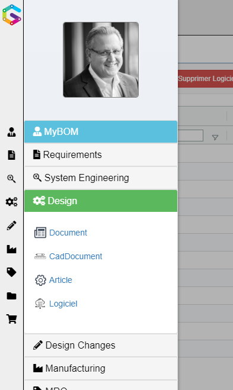

You could also select the type of node you want to list from the 

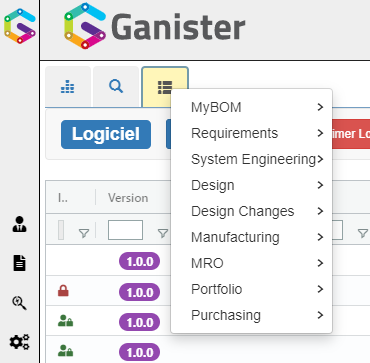

## Main Dashboard

The main dashboard is composed of widgets. We made it configurable to create new widgets. The interface to create new widgets will come later.

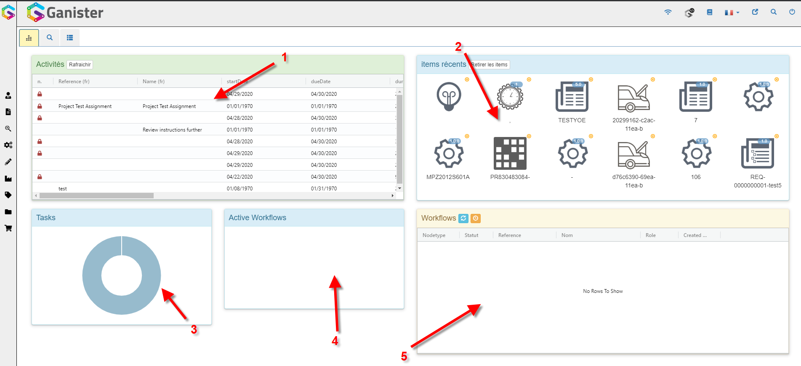

### 1. Activity List

This is the list of all the activities for which you are either the requestor or the actor

### 2. Recent Items

It lists the last 12 opened nodes. You can remove them from the list by either clicking the orange cross or the "remove all" button. 

### 3. Tasks Graph

The tasks graph represents the distribution of the tasks based on their status.

### 4. Workflows Graph

Gives some metrics about active workflows

### 5. Workflows

Lists all the workflows for which you are responsible.

## Search

Search is available out of the box using the magnifier at the top right corner of the screen. 

Just type your search term and hit enter to retrieve results from any type of node.

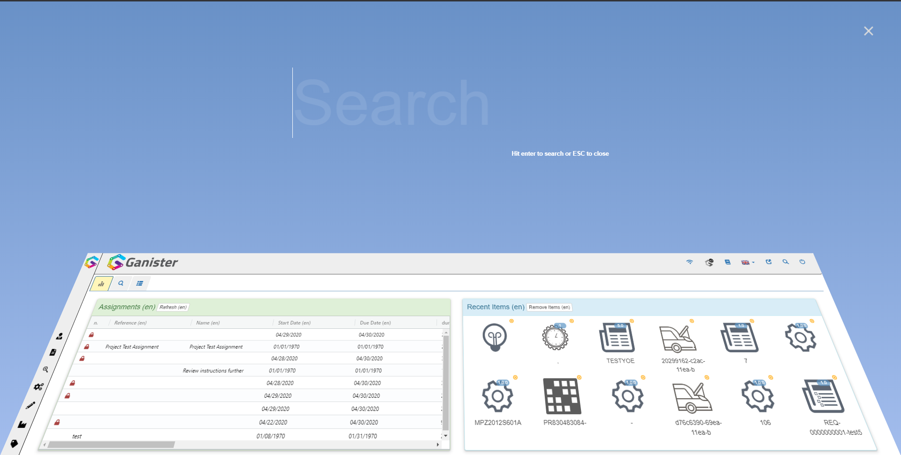

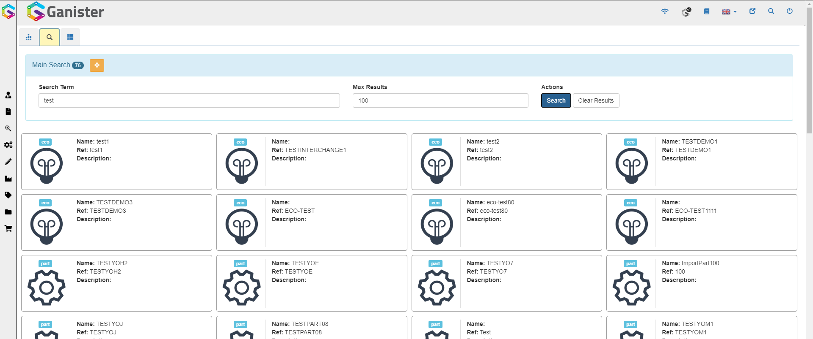

If you need more advanced search capabilities, from the search result you can click the advanced search button to get access to more options like:

- node types to search
- more options on each search term

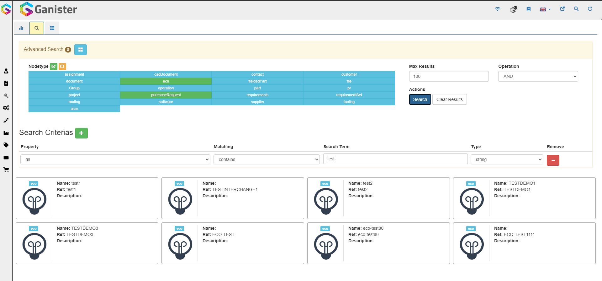

## Main Grid

The main grid lists all the nodes of a specific nodetype for which you have an access. The right panel of the grid allows you to do some organization operations on the columns. It even allows you to do row grouping

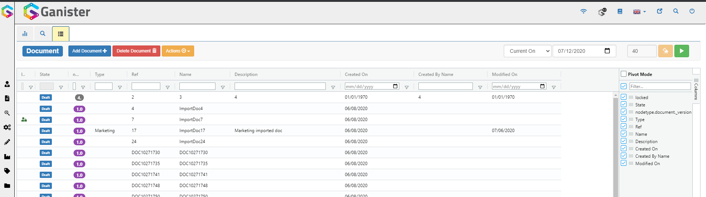

### Grid Search

The main grid has a few search configuration elements:

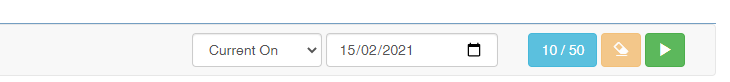

- The search type : "Current On" or "Released On" will either search for the latest version of a node or the latest released version.
- The search data: will define when the search is done (anything created after the defined date will not be returned)
- Result Size / Max Results: by clicking on this button you can define the max result size
- Clean Search : allows to clean all the search criterias in every column
- Run Search

#### Lock state filter

In the first column of most grids you have a lock state icon which can be :
- Green : It is locked by you
- Red : It is locked by someone else
- empty : It is unlocked

It can be useful to filter by the green lock to see what elements you are actually preventing others from editing.

### Reset Main Grid Setup

If admin has changed things to the grid or if you just want to reset the default settings of the grid organisation, you can click on the following specific action.

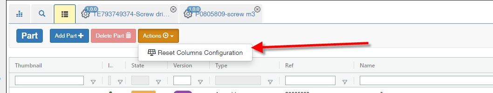

### Grid toolbar

Most grids like the main grid, contain a toolbar on the right side. it can be closed by default.

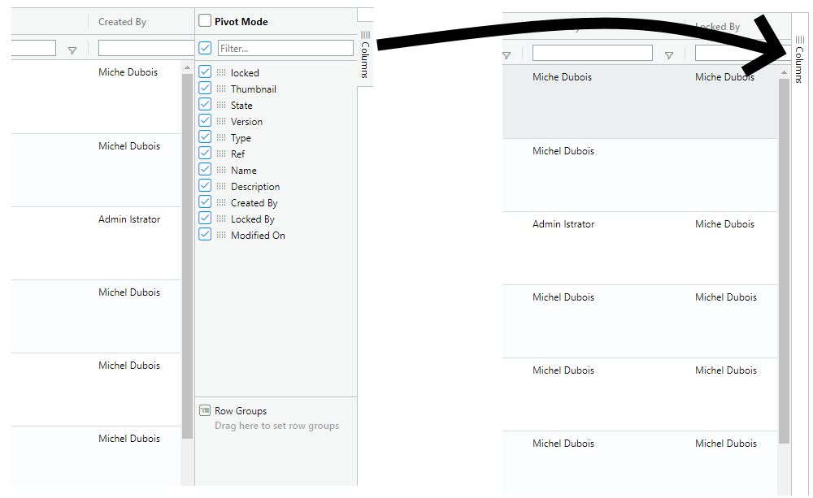

#### Main features

The toolbar provides a quick ability to hide/show properties. It also allows to do row groupings and to set filters. Most of these features are accessible directly on each column in the grid.

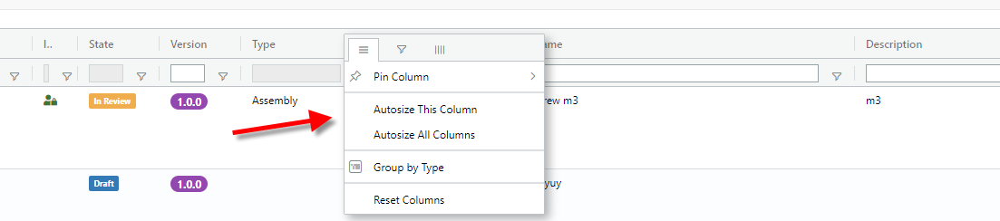

##### Pin Column

A column can be Pinned at the left or the right of the grid. It allows to freeze it while you scroll the grid left or right.

#### Pivot Mode

Pivot mode is not very commonly used in PLM but it can find some use cases with a larger implementation. Like in Ms Excel it allows to do some specific groupings and calculation. A good example would be for a list of part, you put the type as Row group, the state as columns and a count(name) as values and you get a nice pivot report of the number of parts at each lifecycle stage for each type.

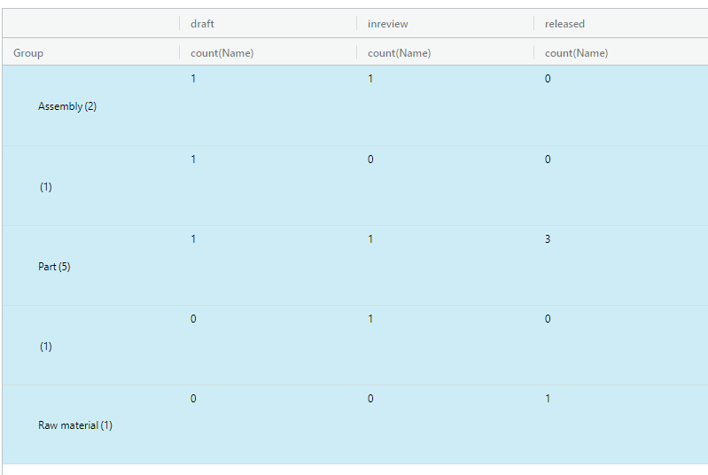

## Node Form

A node form contains a toolbar, a top form and tabs (optional).

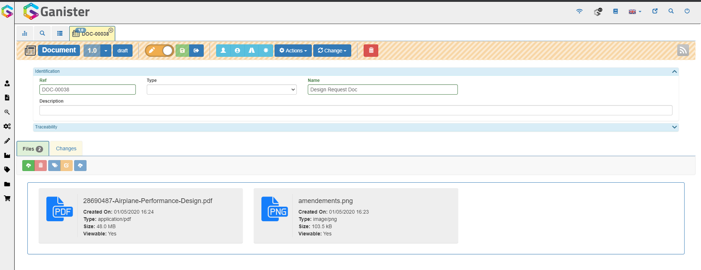