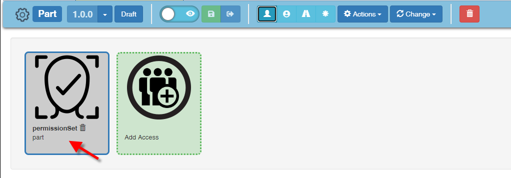

# User Access

## Node Role Levels

| Role Name | Role Permissions                                             |
| --------- | ------------------------------------------------------------ |
| Visitor   | Allows to see the node in a table but not to open the node form |
| Reader    | Allows to see the node in tables and open in form            |
| Writer    | Reader Privileges + allows to edit a node                    |
| Manager   | Writer Privileges + Allows to change accesses                |

## Organic and Team based access
Ganister offers out of the box the capability to handle organic access which are defined based on your role in the company. But it also offers team-based access to have more project specific access. Both access system, for simplicity and performances have been designed with a common concept based on the graph.
### Organic Access Management

### Team-based Access Management

## Node Access
Each node in Ganister has an access schema based on the graph. To access a node a user has to have a specific connection to the node itself. It can be through a group, a team, a permission set or a hierarchy of groups. Every access verification will look for this specific path. Let's review first what are the different nodetypes involved in access management
## Conceptual setup
### Permission Set
A **Permission Set** is a predefined node connected by default to every instance of a nodetype. 
### Group
A **Group** is a predefined node used to group users or other groups to provide a single point of access configuration. A group can also be a Team or a Team role it allows to have a common resolution of user access to business nodes.
### User
A **User** is a node representing a physical person. In order to access any node, the user needs to have a link to this specific node. This link can be direct, or through a permissionSet or a group. The minimum access level on the path will be resolved as the access level.

## User Interface / User Experience

In order to help the user understand why he has access to a certain node (Sometimes to understand why someone else does not have access). On a nodeform we display the access path which authorized the user to access the specific business information.
### Node access presentation

#### Node Access Management
By default a node is created with a link between the permissionSet of its type. Therefore, anyone with an access to the same permissionSet will have access to this node.

| Access Type                                                  | Access Description                                           |
| ------------------------------------------------------------ | ------------------------------------------------------------ |
|  | Permission Set:  It is attached by default it can be removed if you need to restrict to access to a node. You can then re-enable the permissionSet if needed. |
|  | user access: Displays a direct access for a user with its role. |
|  | Team Access : Designates a team with a direct access to this node. By clicking on the magnifier you get the detail of the team. |

#### Access Audit
Ganister offers to possibility to understand how you have access to a node. The following UI accessible from your nodeform toolbar show you the access path between your user and the opened node. At the top right of this panel you can see your highess access to this node. While opening the node we retrieve all the access path and only keep the highest access level with the shortest path.

