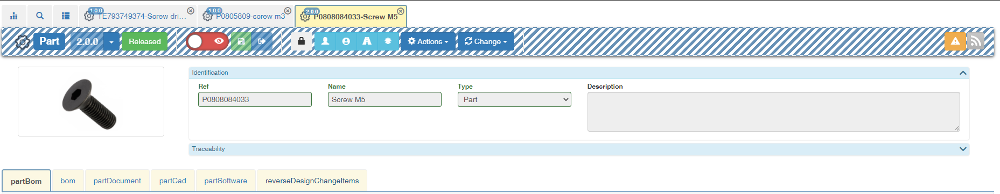

# Product Engineering Basics

Product engineering is mainly built around the Engineering Bill of materials and a few objects and processes around it.

The default forms are fairly simple and can be quickly adapted to your needs.

## Part

### Form

Ganister is built for customizability. It comes with a fairly simple part form which you are encouraged to configure to suit your needs.

### Multilevel BOM

