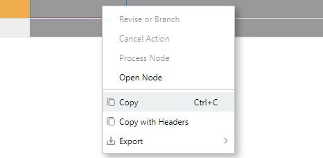

# ECO - Enterprise Change Order

## Goal of an ECO

The ECO has two major objectives:

- Control the validity of any enterprise change. Meaning we evaluate the options and the impact of any change. The ECO is the preliminary gatekeeper for any change.
- Trace changes. Make sure we can understand what a change or a set of changes have been made for.

## Process of the ECO

```flow
gat=>start: Gathering PR
addN=>operation: Add Impacted Elements
makeC=>operation: Execute Changes
revBef=>condition: Review Validity of Change Plan
valid=>condition: Review Execution of Changes
arch=>end: Audit and Archive

gat->addN
addN->revBef
revBef(yes)->makeC
revBef(no)->addN
makeC->valid
valid(yes)->arch
valid(no)->makeC
```

In order to achieve the ECO objective, the flow is fairly simple. It can be enriched with more validation as needed. We can add steps for multiple levels of validations. We can also add conditional verification depending on some changes characteristics (is it impacting an electrical equipment, painting,...).

## Key ECO Concepts in Ganister

- An ECO is used to allow a change, not to release any node (part, document,...)
- Depending on your company configuration changes can be interchangeable or not
- A non interchangeable change does not force an impacted node to be revised.

## ECO Tools

### Impact Matrix

One of the key tools of the ECO is the impact matrix in order to execute the first half of the ECO process. Adding different nodes to the ECO should let the user (and any reviewer) know what's impacted and potentially add these impacted nodes has controlled items.


#### The Grids

Two grids are available, the first grid is the **Before** grid which will typically reflect the changes you are about to allow to process.

In addition to the typical identifying information, the ECO specific columns are the following :

- **Chg Control?** : This will indicate if the node is already controlled by the ECO. A node can only be controlled by one ECO. but a node can be impacted by multiple ECOs. By the default when you add a node to an ECO it is controlled. If a node is displayed as only impacted, you can right-click on it to ask the ECO to start controlling it.
- **Item Action**: It specifies which action will be taken for designated node. It only appears if the node is controlled by the ECO. The list of available action is configurable depending on how many digits you enabled for the nodetype and also if you allow additional actions like fork, obsolete,...
- **interchangeable** (read-only): it tells you, based on your company's configuration if the change you are triggering is interchangeable or not. if it is, the  node parents will automatically take the update (Ganister traceability will keep the links in the database to retrieve the structure at a certain date). If a change is not interchangeable, the parents, will either stay linked to the old revision (with flags raised when the new rev is released), or they have to be revised to take into action this new revision.
-  **New Ref**: This only applies if you are doing a **Fork** which triggers the creation of a new node.
- **Link Action**: in case you **Fork** a node, you may not want to apply this replacement at every location. Therefore for each BOM relationship you need to define if you want the parent to consume the fork or the original (if this is a superseding fork and the parent stay connected to old rev, a flag will be raised on the parent once the new child rev is released).
- **Alternative Node**: In case the link action is set to pick alternative, you can define which part will be used as a replacement.
- **Alternative Node Version**: Reflects the version of the alternative node selected
- **Processed**: Displays if the node has been processed. Only applies when you reach the **InWork** state of the ECO lifecycle
- **Comment**: Helps you track remarks and comments for each line.

The After Grid, is used to display how the controlled nodes have changed through the ECO process.

#### ECO actions

The consequence of a change is either the revision or the forking of an object.

##### None

It happens to not do any change on something that was initially planned for change. If so, the temporary branches created in the context of this ECO are removed on releasing the ECO.

##### Patch - Minor Rev - Major Rev

A revision can occur on any of the 3 digits of the versioning Schema (see versioning). Depending on the nodetype configuration, a revision can be either an increment of the version on the existing node with an historization of the properties and relationships or it can be the creation of a copy of this node with a "Revises" relationship from the new one to the former.

##### Fork

Sometimes you need to create an evolution of a node without superseding the former node. Fork does that. It creates a new node, linked to the original one to keep the information of the origin (but it is not a revision link). You can then review all the use-cases and select wether you change the parents to select the newer node or the former (which is still valid as it is not a revision)

##### Superseding Fork

This is similar to the Fork action, but it actually supersedes the original node. It is more like a revision but the revision is changing so much the node that you decided to create a new ref.

#### Grid Context Click Actions

The ECO grid provides context functions



##### Revise or Branch

Available on an impacted node, it allows to set the node as controlled

##### Cancel Action

Remove the node from controlled nodes.

##### Process Node

Runs the change process. This could be useful if you already ran the process change and you need to add one more node to the change, you can process individually. Warning, it could skip some of the version mechanisms if not everything is done at once.

##### Open Node

Opens the selected node

## ECO sample Scenarios

### Single node change


### Node change with impacted nodes


