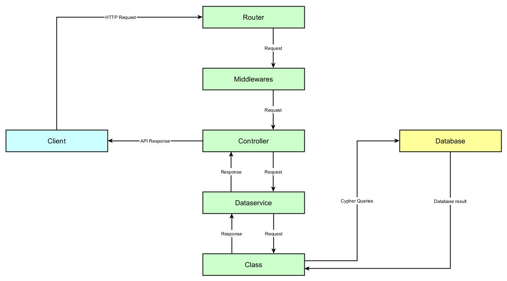

# API MAIN WORKFLOW

When a request is sent to the API, it follows the flow below:

Router, middlewares and controller are an API pattern, so it won't be documented here.
The internal logic of Ganister is mostly contained into 'Dataservice' module and the classes.

### CLASSES

Ganister uses two main classes to modelize datamodel: `Node` and `Relationship`.

Because we represent data as a graph, each created item will be a instance of `Node` class and each relationship between nodes will be an instance of `Relationship`. In other words, everything in the app is either a node or a relationship.

On the API side, it minimizes the number of routes and simplifies their uses. For example, an user, an ECO, or a file can be created, modified or deleted using the same routes and parameters pattern. Idem with relationships.

### DATASERVICE

One of the main advantages of Ganister, it's that is deeply customizable. To fit any needs, custom methods can be created and will manipulate data during operations.

Custom methods can be triggered by a lot of different events: node creation, update, promotion or deletion, are some triggers examples.

`DataService` is the module that handles custom methods triggers. Each time the database is queried, `DataService` checks and executes the right custom methods. Because custom methods depends on data manipulation and not API routes, the custom methods are triggered in all determinated cases and the results are always consistent.

