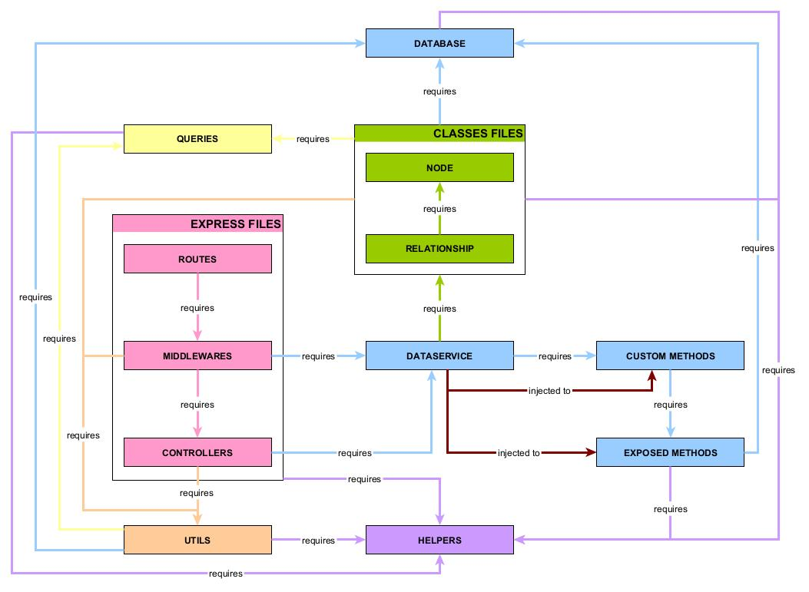

# MODULES DEPENDENCIES

Here's a schema of the way files are required inside the API.

The core concept is to always require `DataService` from middlewares/controllers and never directly require `Node`/`Relationship` classes or modules like `Database`, `CustomMethods`, or `ExposedMethods`.

**Why always use `DataService` module?**
- It handles custom methods triggers for each node/relationship CRUD operations
- It solves circular dependencies between `Node`/`Relationship` classes and `CustomMethods`/`ExposedMethods` modules
- It formats data and/or executes some utilities functions during `Node`/`Relationship` CRUD operations

`DataService` is also injected in `CustomMethods` and `ExposedMethods` modules, so it can be used to write custom methods in G-Config. 

**Why `DataService` is injected to some modules?**
- In `CustomMethods` module, `DataService` is injected as the fifth argument of a custom method execution. This way, `DataService` is available in all custom methods, and `CustomMethods` module can still be required from `DataService`.
- Again in `CustomMethods` module, `DataService` is injected to `ExposedMethods` module as its only argument. This way, `DataService` is available in all exposed methods, and `ExposedMethods` can still be required from `CustomMethods` module.  

 

**Utilities files dependencies**
- Utils files can be required from any file except `Database` module.
- Helpers files can be required from any files, as helpers doesn't require any other file.
