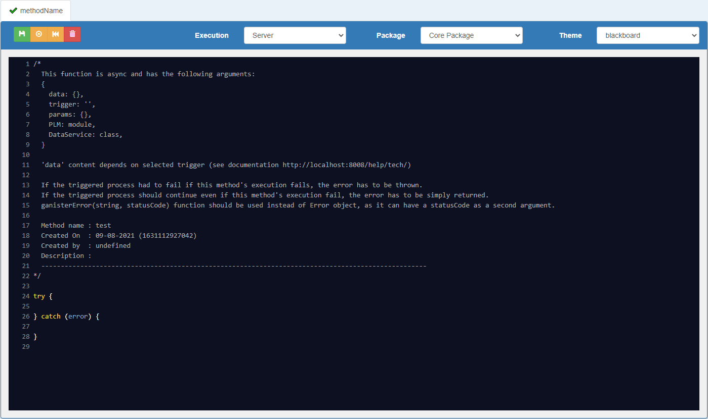
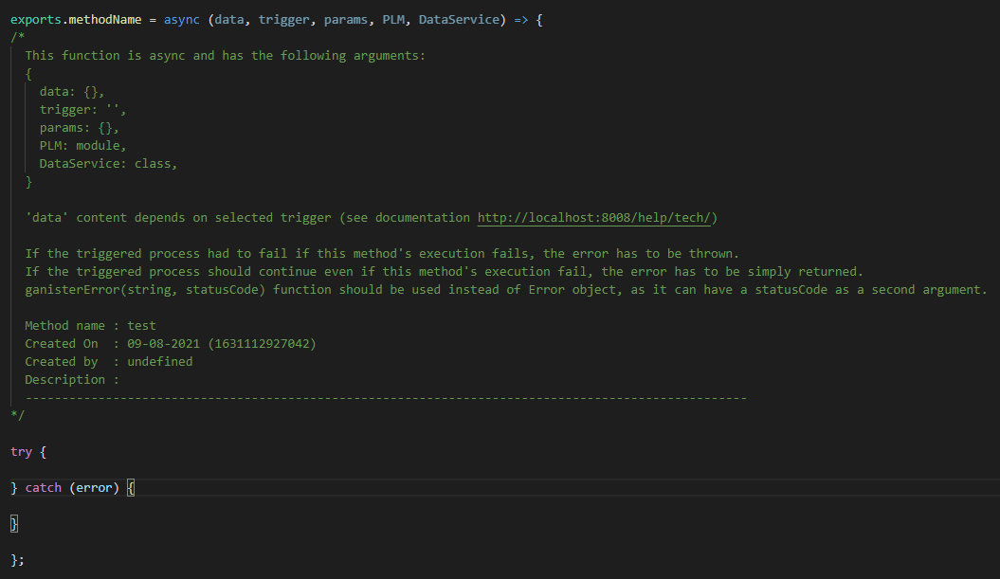

# HOW TO WRITE A SERVER CUSTOM METHOD

Server custom methods are asynchronous functions that can be executed in different contexts.

### Method's editor

In G-Config, the methods editor allows to write custom methods executed on server as on client side.  
The editor only shows the code _inside_ the function, and the method arguments aren't visible.

On server side, server custom methods are saved like any other Javascript functions, with its arguments.  
Server methods' arguments are always the same, only the value of these arguments changes depending on execution context.

 

### Method's arguments

Server custom methods have 5 arguments:
- **data**:  
Depends on the trigger ('afterCreate', 'beforeUpdate', etc).  
It can be an `Node`/`Relationship` instance or an array of `Node`/`Relationship` instances.
- **trigger**:  
A string representing either trigger's name for triggered methods (e.g. 'beforeDelete') or action's ID for action execution.  
Useful to assign different values depending on trigger.
- **params**:  
Params provided in G-Config in Nodetype's Triggered Methods or Nodetype's Actions.  
An empty object by default.
- **PLM**:  
`ExposedMethods` module injection: all exposed methods are available in any custom method.  
`ExposedMethods` includes also `Database` functions and all existing helpers.
- **DataService**:  
`DataService` module injection: `DataService` methods are available in any custom method.  
Allows to execute CRUD operations inside the custom method.  
**/!\ Because `DataService` functions executes triggered methods, infinite loop of custom methods executions can be created.**

 

#### `data` argument
`data` argument value depends on the trigger.  
Current user is always available through `data` as `data.user`, except with the trigger 'afterGetAll'.

| trigger                | `data` value                                                                                                                                                 |
| ---------------------- | ------------------------------------------------------------------------------------------------------------------------------------------------------------ |
| afterGetAll            | array of `Node`/`Relationship` instances found in database                                                                                                   |
| beforeGet              | object representing the node/relationship to get, with `_type` and `_id` keys                                                                                |
| afterGet               | `Node`/`Relationship` instance found in database                                                                                                             |
| beforeCreate           | `Node`/`Relationship` instance with properties sent by the user                                                                                              |
| afterCreate            | `Node`/`Relationship` instance as it's saved in database (with properties sent by the user, generated properties and `_id` key)                              |
| beforeUpdate           | `Node`/`Relationship` instance found in database with updated properties sent by the user applied                                                            |
| afterUpdate            | `Node`/`Relationship` instance as it's saved in database (with updated properties sent by the user and updated generated properties)                         |
| beforeDelete           | `Node`/`Relationship` instance found in database                                                                                                             |
| afterDelete            | object representing the deleted node/relationship, with keys `type`, `id`, and `message`                                                                     |
| node's action (id)     | `Node` instance found in database and `clientMethodData` key, an object storing any data to share with client custom methods                                 |
| nodetype's action (id) | object with `_type` key (nodetype's name), `clientMethodData` key (object storing any data to share with client custom methods) and `user` key (current user)|

 

### Method's code

#### Syntax
- A server custom method is asynchronous and written with _async/await_ syntax. _try/catch_ syntax is by default but not mandatory.
- It doesn't need to return anything as the goal of a server custom method is to manipulate `data` argument and/or data in database.

#### Errors
- Errors can be handled in two ways:  
-> if the error should stop all the process (e.g. a node's update), it has to be thrown (`throw error`)  
-> if the error should not stop the process, it has to be simply returned (`return error`)
- Error instances can be:  
-> generated by the function `ganisterError(message, statusCode)` (`throw ganisterError('An error occured', 500)`)  
-> a `new Error` class instance (`throw new Error('An error occured')`)

