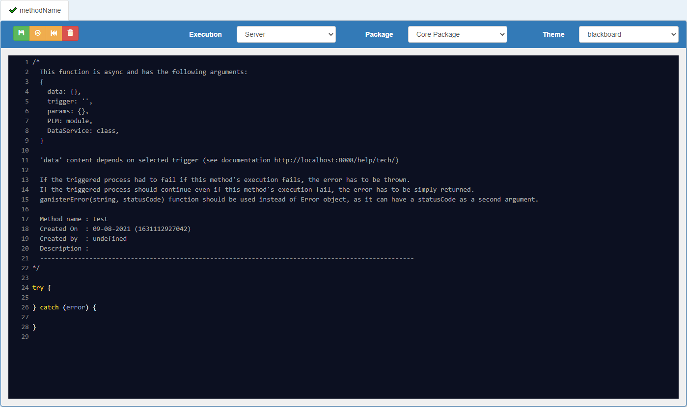

# HOW TO WRITE A CLIENT CUSTOM METHOD

Client custom methods are asynchronous functions that can be executed in different contexts.

### Method's editor

In G-Config, the methods editor allows to write custom methods executed on server as on client side.  
The editor only shows the code _inside_ the function, and the method arguments aren't visible.

On server side, client custom methods are saved like any other Javascript functions, with its arguments.  
Client methods' arguments are always the same, only the value of these arguments changes depending on execution context.

 

### Method's arguments

Client custom methods have 3 arguments:
- **$scope**:  
- **$rootScope**:  
- **data**:
  an object storing any values to share with other client custom methods and/or server custom methods

 

### Method's code

#### Syntax
- A client custom method is asynchronous and written with _async/await_ syntax. _try/catch_ syntax is by default but not mandatory.
- It doesn't need to return anything as the goal of a client custom method is to manipulate `$scope`, `$rootScope` and/or `data` arguments.

#### Errors
<!-- - Errors can be handled in two ways:
-> if the error should stop all the process (e.g. a node's update), it has to be thrown (`throw error`)  
-> if the error should not stop the process, it has to be simply returned (`return error`)
- Error instances can be:  
-> generated by the function `ganisterError(message, statusCode)` (`throw ganisterError('An error occured', 500)`)  
-> a `new Error` class instance (`throw new Error('An error occured')`) -->

