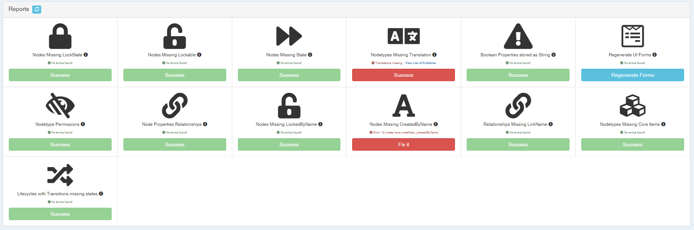
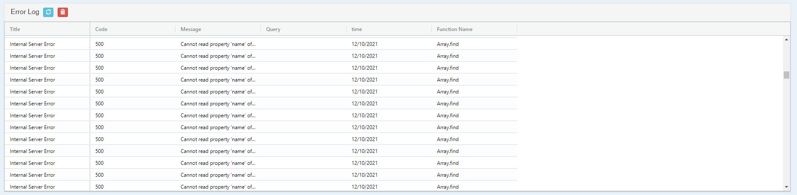
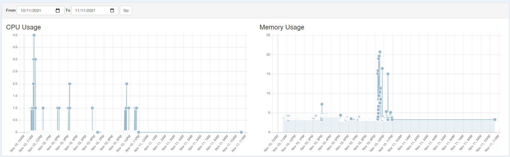
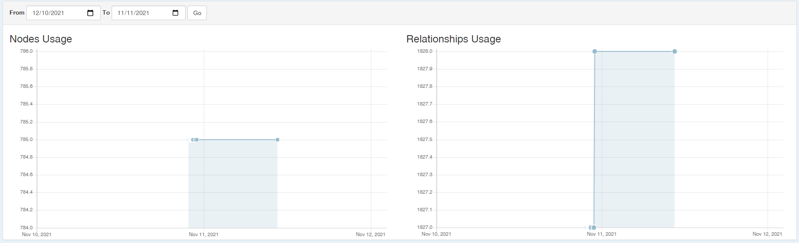

# Health Report
## Health Reports
The first panel lists db health reports and datamodel health reports.

### Database Health Reports

- Nodes missing lockstate: Detects nodes in the database which do not have the _lockState property. Could come from an import issue.
- Nodes missing lockable: Detects nodes in the database which do not have the _lockable property. Could come from an import issue.
- Node missing state: Detect nodes in the database which may not have the _state property. Usually because the imported state did not exist.
- Boolean Properties stored as String: Comes from either an old version of Ganister or an import issue
- Circular References: Checks if Circular References exist in the database. It is however sometimes possible, the graph db won't crash because of circular references.
- Nodes Missing LockedByName: Usually comes from Import issue.
- Nodetype Permissions: Checks if all nodetypes have permission in the database
- Nodes Missing CreatedByName: Usually comes from Import issue.

### Datamodel Health Reports

- Nodetypes Missing Translation: Looks for missing translation
- Regenerate UI Forms: Regenerates all the forms from the datamodel
- Node Properties Relationships: Check if node properties are defined with existing relationships
- Relationships Missing LinkName: Check if each relationship have a correct linkname
- Nodetypes Missing Core Items: Checks for missing core items on nodetype and relationshiptype definitions
- Lifecycles with Transitions missing states: Check if all lifecycle transition are connecting existing states

## Error Log
Every API Error is logged in this table.

## System Analytics
We log system CPU and memory consumption to better understand if the server may be limited for a certain usage.

## Db Analytics
We log every day the number of relationships and nodes in your graph database.
