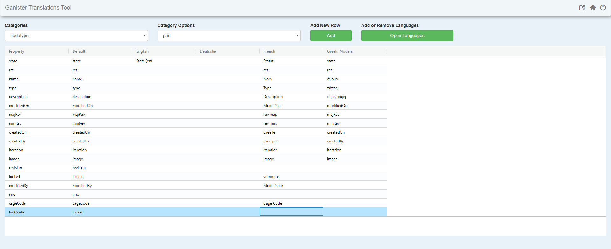

# Translations

All the translations can be updated on this page.

## Translations Categories

We separate translations into 4 categories:

- **Default**
- **Nodetype**
- **Relationship**
- **Widget**

Then for each category, we have the category options. For example, if you choose the nodetype category, the category options will be all the nodetypes in your datamodel. You would then be able to see the translation for each property and each language. *(See image above)*

## Add Translation Row

You can manually add a new property for translation by clicking on the **add row** button.

## Remove Translation Rows

You can delete a translation row by selecting the rows and clicking on the **Delete Selected Rows** button.

## Add a new Language

You can add a new language by clicking on the **Open Languages** button and then clicking on the **Add Language** button.

## Remove a Language

To remove a language, click on the **Open Languages** button and then click on the **Remove Language** button.