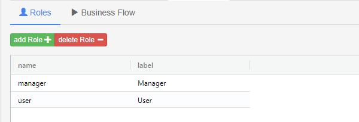
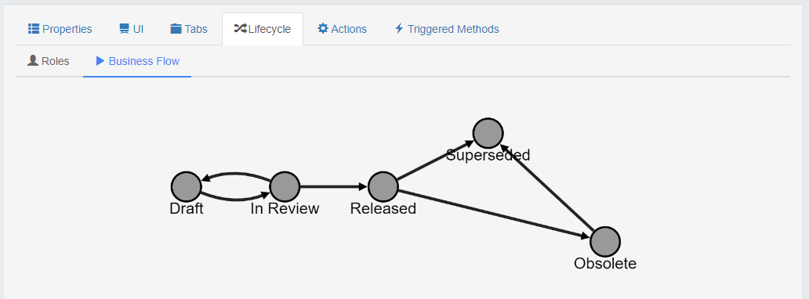

# Lifecycle

Most PLM system have lifecycles and workflows which can become very sophisticated, on the paper, but difficult to maintain.

## Concept

With Ganister the golden rule is every node at a State can only have one responsible person. You can still distribute activities and/or quickly change the responsible but we wanted to make the responsabilities clear and easy to manipulate.

## Roles

First you describe the roles who will have some responsability on the lifecycle. There is no limitation here.

## Business Flow

Once the roles are defined you can design your business flow.

