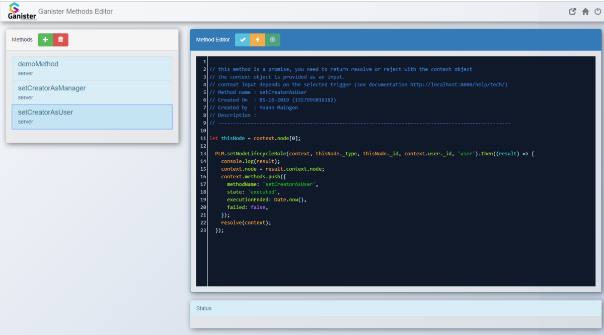

# Nodetype Methods

Every PLM implementation requires a little bit of specific treatment. Most companies tend to have their own specific processes in order to achieve a better work then the competition. Most capabilities in Ganister are managed through clicks on some options and we try to provide as much as possible the configurability of the application on this configuration level.

Sometimes it is still needed to go further with the specifics of the implementation. Therefor we have built a method editor which allows to define specific behavior triggered either by a user action or some major system events like an node creation, a node update or even a node promotion.

## Method edition

The method edition is available in the configuration panel. All the documentation to write specific behavior is available here : [method editor doc](../30-Development/10-methodEditor.html).

