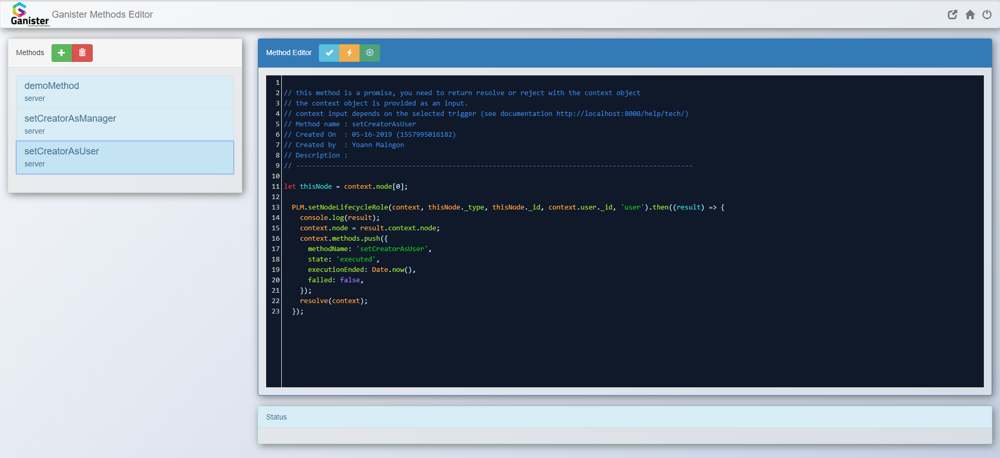

# Method Editor



The method editor allows to go further with customization. A method is typically either launched from a user action or from an API event like a node creation, update, deletion.

~~~flow
```flow
st=>start: API Request
prem=>inputoutput: Pre-Method
nextPre=>operation: Execute next Pre-Method
condStillPre=>condition: Pre-methods remaining?
mainOperation=>inputoutput: Main Operation
nextPost=>operation: Execute next Post-Method
postm=>inputoutput: Post-Methods 
condStillPost=>condition: Post-methods remaining?
e=>end: API Answer

st->nextPre->prem->condStillPre
condStillPre(no)->mainOperation
condStillPre(yes)->nextPre
mainOperation->nextPost->postm->condStillPost
condStillPost(yes)->nextPost
condStillPost(no)->e
```
~~~